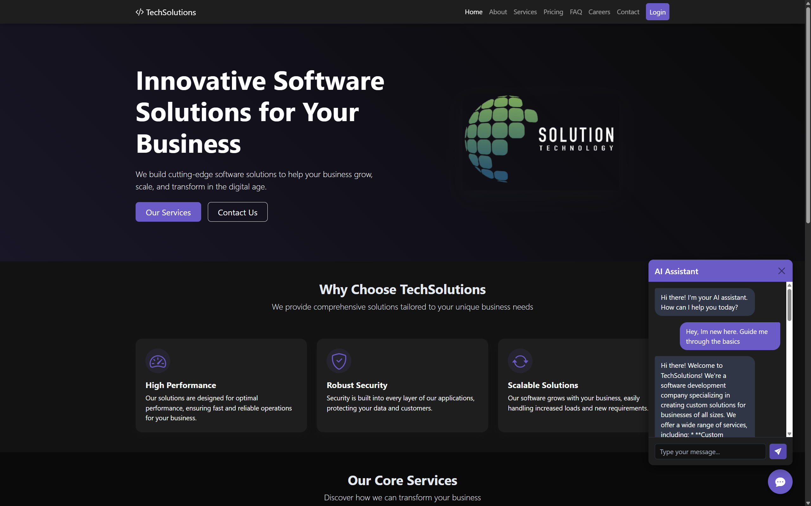

# TechSolutions Website

🌐 **Live Demo**: [https://ganesh2609.github.io/TechSolutionsWebsite/](https://ganesh2609.github.io/TechSolutionsWebsite/)

A modern, responsive website for TechSolutions - a fictional tech company offering various IT services and solutions. Built with HTML, CSS, JavaScript for the frontend and Flask with Gemini AI integration for the backend chat functionality.



## 🌟 Features

- **Responsive Design**: Works seamlessly across desktop, tablet, and mobile devices
- **Modern UI**: Clean and professional dark-themed interface with animations and interactive elements
- **Multiple Pages**: Complete website with Home, About, Services, Pricing, FAQ, Careers, and Contact pages
- **AI Chatbot**: Interactive AI assistant powered by Google's Gemini AI
- **Authentication System**: Basic login and registration functionality (client-side demo)
- **Backend API**: Flask-based API for handling the AI chatbot functionality
- **GitHub Pages Integration**: Set up with GitHub Actions workflow for easy deployment

## 🛠️ Technology Stack

- **Frontend**:
  - HTML5
  - CSS3 (with Bootstrap 5 framework)
  - JavaScript (ES6+)
  - Bootstrap Icons
  
- **Backend**:
  - Python 3.x
  - Flask
  - Google Generative AI (Gemini)

## 🚀 Getting Started

Follow these instructions to get the project up and running on your local machine.

### Prerequisites

- Python 3.7+ installed on your system
- Google API key for Gemini AI ([Get it here](https://ai.google.dev/))
- Basic knowledge of HTML, CSS, and JavaScript
- A modern web browser (Chrome, Firefox, Safari, or Edge)

### Installation

1. **Clone the repository**

```bash
git clone https://github.com/Ganesh2609/TechSolutionsWebsite.git
cd TechSolutionsWebsite
```

2. **Set up the environment**

```bash
# Create a virtual environment
python -m venv venv

# Activate the virtual environment
# On Windows
venv\Scripts\activate
# On macOS/Linux
source venv/bin/activate

# Install required dependencies
pip install -r backend/requirements.txt
```

3. **Configure the environment variables**

Create a `.env` file in the `backend` directory with the following content:

```
# Get this from https://ai.google.dev/
GOOGLE_API_KEY=your_gemini_api_key_here

# Flask app settings
FLASK_ENV=development
FLASK_DEBUG=1
FLASK_APP=app.py

# Server settings
HOST=0.0.0.0
PORT=5000
```

### Running the Application

1. **Start the backend server**

```bash
python backend/app.py
```

The Flask server should start running on `http://localhost:5000`.

2. **Open the website**

Simply open the `index.html` file in your web browser:

- Double-click the file in your file explorer, or
- Open it using your preferred web browser's "Open File" option, or
- Using a command line:
  ```bash
  # On Windows
  start index.html
  
  # On macOS
  open index.html
  
  # On Linux
  xdg-open index.html
  ```

3. **Explore the website**

Navigate through the different sections of the website to explore the services, team members, and other features.

## 📦 Project Structure

```
TechSolutionsWebsite/
├── .github/            # GitHub Actions workflow configurations
├── backend/            # Flask backend for AI chatbot
│   ├── app.py          # Main Flask application
│   ├── requirements.txt # Python dependencies
│   └── .env            # Environment variables (create this file)
├── css/                # CSS stylesheets
│   ├── style.css       # Main stylesheet
│   └── chat.css        # Chat widget styles
├── js/                 # JavaScript files
│   ├── script.js       # Main JavaScript file
│   └── chat.js         # Chat widget functionality
├── images/             # Image assets
├── *.html              # HTML pages (index.html, about.html, etc.)
├── vercel.json         # Vercel deployment configuration
└── README.md           # Project documentation
```

## 🎨 Customization

### Changing the theme

The website uses a dark theme by default. To modify the colors, edit the CSS variables in the `css/style.css` file:

```css
:root {
    --dark-bg: #121212;
    --darker-bg: #0a0a0a;
    --card-bg: #1e1e1e;
    --primary: #6d5acd;
    --primary-hover: #5a48b6;
    /* ... other variables ... */
}
```

### Adding new pages

To add a new page:

1. Create a new HTML file based on an existing page template
2. Update the navigation links in all pages to include the new page
3. Add your content to the new page
